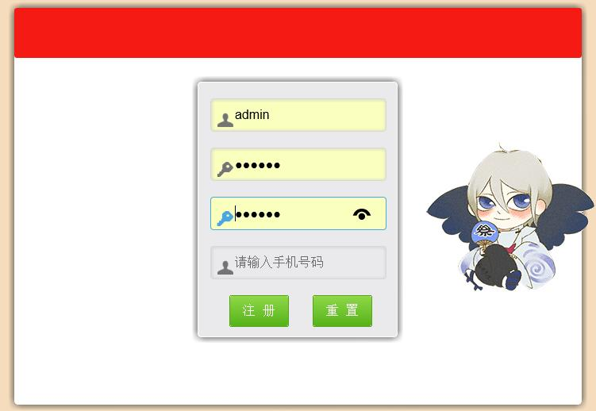

# Website
一个简易的网站，目前完成的功能为登录、注册.

前端由html+CSS+Jquery完成，可校验注册。后台由as写成，较为轻量型。

由于github只支持utf-8，因为使用as写的，后续功能投票、留言必须要用GB2312，因此不上传了。

The url（直接访问的网址）：https://orangesnow.github.io/Website/WebTest/index.html

## 登入界面
进行登入，可记住用户名、密码，存到cookies里

