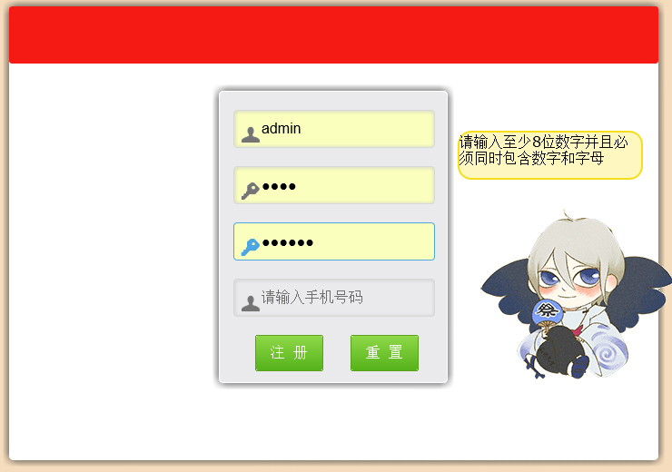
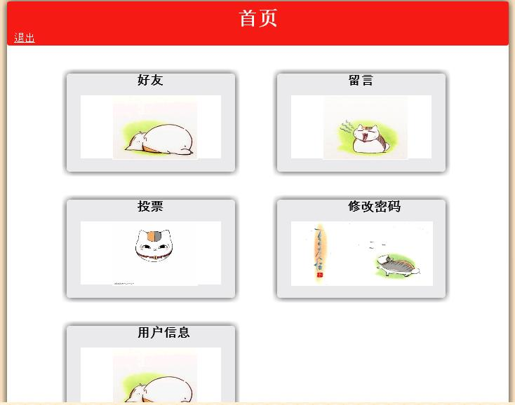
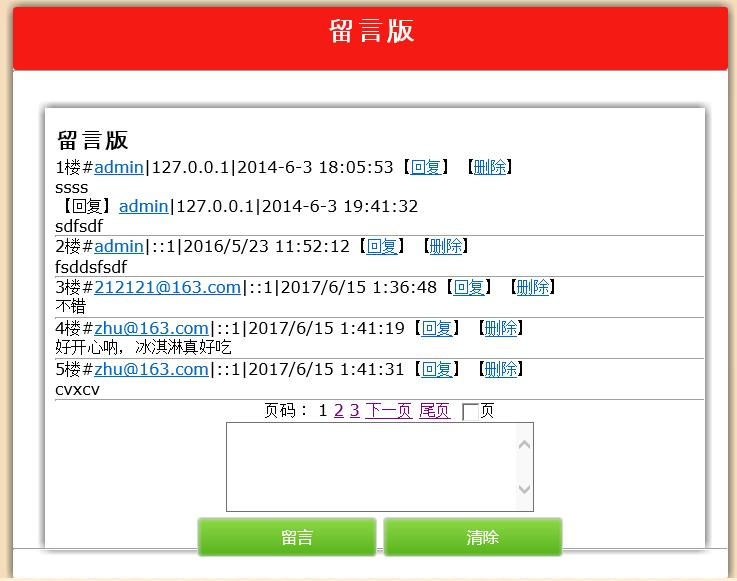
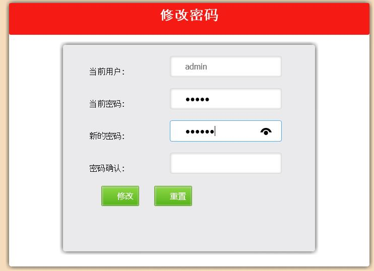
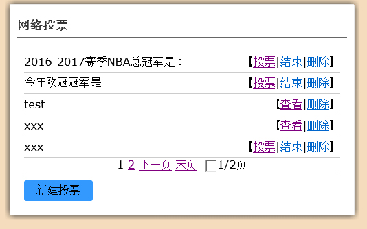

# Website
一个简易的网站，目前完成的功能为登录、注册.

前端由html+CSS+Jquery完成，可校验注册。后台由as写成，较为轻量型。

由于github只支持utf-8，因为使用as写的，后续功能投票、留言必须要用GB2312，因此不上传了。

The url（直接访问的网址）：https://orangesnow.github.io/Website/WebTest/index.html

## 登入界面
进行登入，可记住用户名、密码，存到cookies里

## 注册界面
用户进行注册

右侧会有弹窗提示用户名是否符合规范、密码输入是否正确

注册内容正确通过校验，才能注册成功。

## 首页
在首页可以看到各个功能模块，由于以下模块编码是GB2312，因此没有上传

## 留言板
可以进行留言、回复、删除

## 修改密码

## 投票
可以查看投票、删除投票、新建投票

